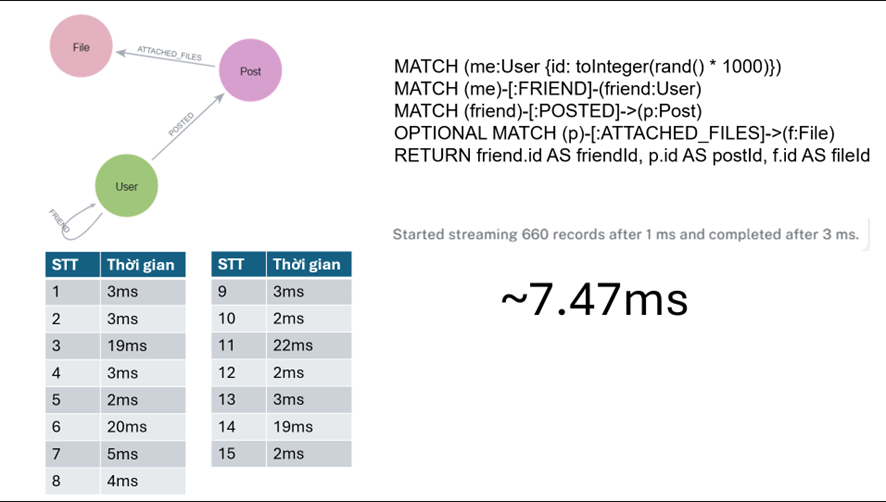

# ỨNG DỤNG MÔ HÌNH ĐỒ THỊ TRONG XÂY DỰNG WEBSITE MẠNG XÃ HỘI


## Giới thiệu

Đây là ứng dụng mạng xã hội chạy trên nền tảng web, với mục đích tạo ra một không gian trực tuyến giúp người dùng kết nối, chia sẻ và tương tác với nhau dễ dàng. Hệ thống hỗ trợ các chức năng như đăng bài viết, bình luận, kết bạn, nhắn tin và thông báo theo thời gian thực. Mục tiêu của ứng dụng là xây dựng một nền tảng thân thiện, bảo mật và mở rộng dễ dàng để phục vụ nhu cầu kết nối cộng đồng, đặc biệt hướng đến người dùng Việt Nam.

## Công nghệ sử dụng

### Backend
- **Spring**: Framework Java để xây dựng ứng dụng web nhanh chóng, dễ cấu hình và dễ triển khai
- **Neo4j**: Cơ sở dữ liệu đồ thị phù hợp cho việc lưu trữ và truy vấn dữ liệu theo quan hệ giữa các đối tượng
- **SQLite**: Cơ sở dữ liệu gọn nhẹ, dễ triển khai
- **WebSocket**: Giao thức truyền thông hai chiều, liên tục giữa client và server cho các tính năng thời gian thực
### Công cụ phát triển
- **IntelliJ IDEA**: IDE mạnh mẽ cho phát triển Java và Spring Boot
- **Docker**: Nền tảng ảo hóa giúp đóng gói và triển khai ứng dụng dễ dàng
- **Git**: Hệ thống quản lý mã nguồn phân tán

## Vì sao chọn Neo4j thay vì MySQL (RDBMS)?
Trong Mạng xã hội, về mặt tự nhiên được biểu hiện dưới dạng đồ thị như (User)-[:FRIEND]-(User), (User)-[:LIKED]->(Post), … chúng vẫn có thể biểu diễn trong RDBMS bằng cách tạo ra nhiều bảng trung gian, tuy nhiên cách tiếp cận này khiến cơ sở dữ liệu trở nên phức tạp hơn.
- Truy vấn hiệu suất cao hơn khi xử lý nhiều thực thể qua nhiều mối quan hệ:
  + Trong RDBMS, các truy vấn quan hệ phức tạp thường phải dùng nhiều phép JOIN. Khi số lượng bảng và bản ghi tăng lên, hiệu suất sẽ giảm do phải quét bảng và kết hợp dữ liệu.
  + Với Neo4j, các mối quan hệ giữa các thực thể (cạnh trong đồ thị) được lưu trữ trực tiếp. Khi truy vấn cơ sở dữ liệu có thể đi theo các cạnh để truy xuất các thực thể liên quan mà không cần JOIN, giúp cải thiện hiệu suất rõ rệt trong các hệ thống có mối quan hệ phức tạp như mạng xã hội.
  
_Thử nghiệm cho thấy Neo4j thực hiện truy vấn qua 3 quan hệ nhanh hơn MySQL đáng kể._




## Mô hình cơ sở dữ liệu


## Chức năng chính

- **Xác thực**: Đăng ký, đăng nhập, quản lý tài khoản
- **Quản lý bài viết**: Đăng, chỉnh sửa, xóa bài viết
- **Bình luận**: Tương tác với bài viết qua bình luận
- **Trang cá nhân**: Xem và quản lý thông tin cá nhân
- **Nhắn tin**: Giao tiếp trực tiếp giữa người dùng theo thời gian thực
- **Thông báo**: Hệ thống thông báo theo thời gian thực
- **Tìm kiếm**: Tìm người dùng, bài viết và nội dung
- **Quản lý mối quan hệ**: Kết bạn, hủy kết bạn, chặn người dùng
- **Thống kê**: Xem thống kê về các hoạt động của trang 

## Những thách thức của dự án

- **Hiệu năng và khả năng mở rộng**: Đảm bảo hệ thống phục vụ lượng lớn người dùng đồng thời
- **Bảo mật và quyền riêng tư**: Bảo vệ dữ liệu người dùng và chống các cuộc tấn công phổ biến
- **Tính năng thời gian thực**: Đảm bảo nhắn tin, thông báo hoạt động theo thời gian thực
- **Trải nghiệm người dùng**: Giao diện trực quan, thân thiện và tương thích đa thiết bị
- **Quản lý quan hệ người dùng**: Hỗ trợ các mối quan hệ phức tạp giữa người dùng
- **Quản trị hệ thống và phân quyền**: Phân định rõ vai trò và quyền hạn của quản trị viên
- **Caching & paging**: Lượng dữ liệu lớn cần được xử lý hợp lý 
## Kết quả mong đợi

- Hệ thống mạng xã hội hoạt động ổn định với đầy đủ chức năng
- Giao diện người dùng thân thiện và responsive
- Các tính năng thời gian thực hoạt động mượt mà
- Hệ thống quản trị đầy đủ và linh hoạt
- Đảm bảo tính bảo mật và quyền riêng tư
- Khả năng mở rộng và bảo trì dễ dàng

## Cài đặt và chạy dự án

### Yêu cầu hệ thống
- Java 17+
- Maven
- Docker và Docker Compose (Không cần thiết nếu không dùng)
- Neo4j (Có thể chạy qua container Docker)
- Redis (Có thể chạy qua container Docker)

### Cài đặt

1. Clone repository:
```bash
git clone https://github.com/thangtranitwork/social-network.git
cd social-network
```

2. Thiết lập biến môi trường qua file .env:
- NEO4J_USER=username neo4j
- NEO4J_PASS=mật khẩu neo4j
- NEO4J_URI=đường dẫn neo4j
- JWT_ACCESS_TOKEN_KEY=khóa JWT
- JWT_ACCESS_TOKEN_DURATION=thời gian tồn tại của token
- JWT_REFRESH_TOKEN_DURATION=thời gian tồn tại của refresh token
- VERIFY_EMAIL_DURATION=thời gian tồn tại của email xác thực
- MAIL=Gmail
- MAIL_PASSWORD=mật khẩu ứng dụng của gmail
- FRONTEND_ORIGIN=url frontend
- SELF_ORIGIN=url backend
- REDIS_HOST=url redis
- REDIS_USERNAME=username redis
  REDIS_PASSWORD=password redis
  REDIS_PORT=port redis
- STRINGEE_API_SID=lấy từ stringee api
- STRINGEE_API_SECRET_KEY=lấy từ stringee api
- GEMINI_KEY=truy cập ai studio tạo gemini api key

### Chạy bằng docker compose:

Bỏ phần comment trong docker-compose.yml sau đó chạy:
```bash
docker compose --env-file .env up
```
hoặc
```bash
docker-compose --env-file .env up
```

### Chạy ứng dụng bằng java và maven

Nếu dùng Redis và Neo4j qua docker hãy chạy lệnh:
```bash
docker compose --env-file .env up
```
Sau đó chạy file .run-env.cmd
```bash
.run-env.cmd
```
**_[Server đang chạy ở port 2003](http://localhost:2003)_**
## Cấu trúc dự án

```
social-network-api/
├── src/
│   └── main/
│       ├── java/            # Mã nguồn Java
│       └── resources/       # Cấu hình và tài nguyên
├── pom.xml                  # Cấu hình Maven
├── docker-compose.yml       # Cấu hình Docker Compose
├── Dockerfile               # Cấu hình Dockerfile
├── .env                     # Cấu hình biến môi trường
├── init-neo4j.sh            # Load data khi khởi tạo neo4j container
├── neo4j.dump               # Data mẫu
└── README.md                # Tài liệu dự án
```

## Frontend
[Social Media App](https://github.com/Hoang18769/social-media-app)
## Tài liệu tham khảo
1. [Neo4j Documentation – Neo4j, Inc.](https://neo4j.com/docs/)
2. [Spring Framework Documentation – Spring Team](https://docs.spring.io/spring-framework/docs/current/reference/html/)
3. [React Documentation – Meta](https://react.dev/)
4. [Tailwind CSS Documentation – Tailwind Labs](https://tailwindcss.com/docs)
5. [Next.js Documentation – Vercel](https://nextjs.org/docs)
6. Christensen, J. (2025, March 13). [*Graph database vs. relational database: What’s the difference?*](https://neo4j.com/blog/graph-database/graph-database-vs-relational-database/)
7. Z. Zhang, Y. Liu, W. Ding, and W. W. Huang. *[A Friend Recommendation System Using Users’ Information of Total Attributes]([https://www.cs.umb.edu/~ding/papers/ICDS2015.pdf](https://www.cs.umb.edu/~ding/papers/ICDS2015.pdf))*, Dept. of Management, Xi’an Jiaotong University, and Dept. of Computer Science, Univ. of Massachusetts Boston.

## Liên hệ
- Email: [thangtran.it.work@gmail.com](mailto:thangtran.it.work@gmail.com)
